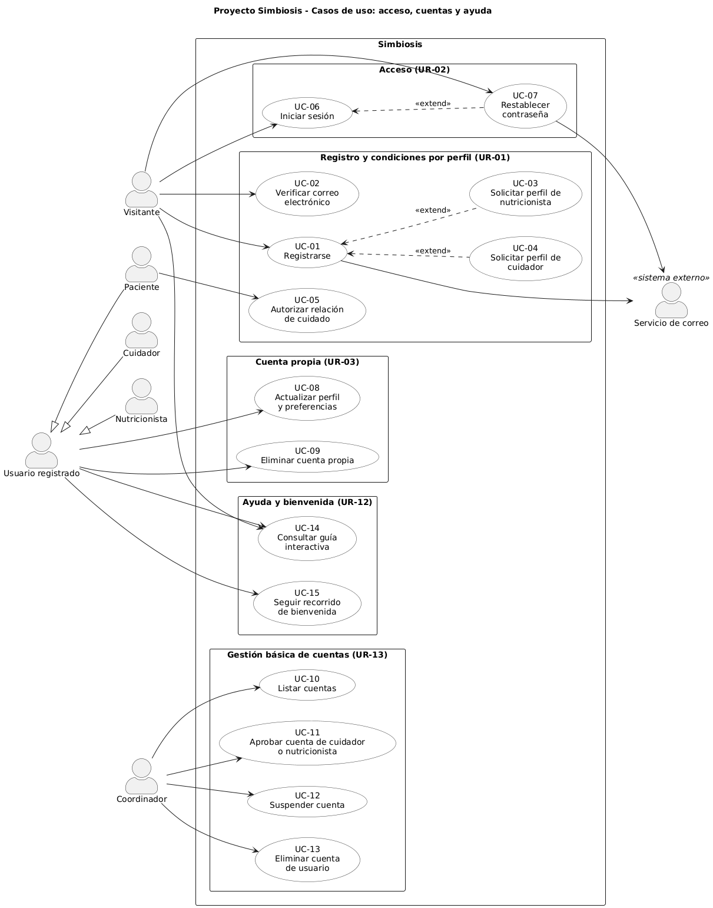

# Modelo de casos de uso de Proyecto Simbiosis

| Versión | Fecha | Estado |
| --- | --- | --- |
| 1.4 | 07/10/2026 | Borrador |

**Iteración de referencia:** E1.

Este documento recoge el modelo de casos de uso del proyecto. Se completa a medida que se incorporan funciones. Los diagramas muestran distintas vistas del mismo modelo.

Sustituye las indicaciones entre corchetes por tu contenido. Añade filas cuando las necesites. Si un apartado aún no se ha trabajado, indica que está pendiente. No inventes respuestas para completar la plantilla.

**Trabajo en E1.** El producto principal es el diagrama de la primera vista. Usa las funciones del apartado 4 del [plan de E1](../planificacion/plan-iteracion-e1.md). La anotación de alcance puede ser breve. Los apartados siguientes permiten organizar el modelo y continuarlo después. No se requieren descripciones detalladas de los casos en E1 ni se establece una entrega adicional.

**Evolución del documento.** Mantén este archivo al avanzar de iteración. Conserva los identificadores de los elementos que sigan siendo los mismos. Actualiza los datos iniciales cuando registres una nueva versión del modelo. Cambia el estado de «Plantilla» a «Borrador» al empezar a completarlo. Usa «Revisado» solo después de la revisión correspondiente. Git conservará los estados registrados en commits.

## 1 Alcance del modelo

Explica qué funcionalidad representa el modelo en su estado actual. Indica qué funciones quedan pendientes. En E1, remite al plan para situar el alcance. No copies el catálogo completo.

El modelo representa las funciones del apartado 4 del [plan de E1](../planificacion/plan-iteracion-e1.md): registro local y condiciones por perfil (UR-01), acceso local y contraseña (UR-02), perfil y cuenta propia (UR-03), gestión básica de cuentas (UR-13) y ayuda y bienvenida (UR-12). La cobertura es parcial: cada UR se representa solo en la parte seleccionada para E1.

Quedan pendientes, según el apartado 5 del plan: el acceso con Google, el uso del alias en espacios públicos, la ayuda sobre otras funciones, el progreso y la búsqueda en la ayuda, el bloqueo temporal y la expulsión, el ciclo de vida de la relación de cuidado y los UR-04 a UR-11. FR-017 está retirado y no se modela.

En iteraciones posteriores, actualiza el alcance acumulado. Distingue las funciones nuevas de las que ya estaban representadas. Una vista puede cubrir solo una parte de un UR o de un módulo.

## 2 Actores

Registra los roles externos que participan en las funciones representadas. Un actor puede ser una persona o un sistema externo. Describe cada rol con una frase breve. No confundas estos roles con las personas del equipo de desarrollo.

| Nombre del actor | Rol que representa |
| --- | --- |
| Visitante | Persona sin sesión iniciada que se registra, verifica su correo, inicia sesión o restablece su contraseña. |
| Usuario registrado | Persona con sesión iniciada.Es un actor abstracto: quien lo usa actúa siempre como Paciente, Cuidador o Nutricionista.|
| Paciente | Usuario registrado que autoriza las relaciones de cuidado que le afectan. |
| Cuidador | Usuario registrado que indica los pacientes a los que cuidará. |
| Nutricionista | Usuario registrado que aporta documentación profesional para su aprobación. |
| Coordinador | Persona responsable de listar, aprobar, suspender y eliminar cuentas. |
| Servicio de correo | Sistema externo que envía los correos de verificación y de restablecimiento. |

Mantén los mismos nombres en las tablas, los diagramas y las descripciones.

Usuario registrado es el actor general. Paciente, Cuidador y Nutricionista son sus actores especializados y heredan los casos de uso del actor general. Una misma cuenta puede tener a la vez los perfiles de paciente y de cuidador (FR-212). El actor Visitante no es una especialización de Usuario registrado.

## 3 Casos de uso

Registra los casos que aparecen en el modelo. Asigna a cada caso un identificador estable. Escribe el nombre con un verbo y un objeto. Resume el objetivo sin describir todos sus pasos.

| Identificador | Nombre | Objetivo | Participantes |
| --- | --- | --- | --- |
| UC-01 | Registrarse | Crear una cuenta local, que queda pendiente hasta verificar el correo. | Visitante (principal); Servicio de correo (apoyo) |
| UC-02 | Verificar correo electrónico | Confirmar la dirección de correo y completar el registro. | Visitante |
| UC-03 | Solicitar perfil de nutricionista | Aportar la documentación profesional para solicitar el perfil. | Visitante |
| UC-04 | Solicitar perfil de cuidador | Indicar los pacientes a los que se va a cuidar. | Visitante |
| UC-05 | Autorizar relación de cuidado | Autorizar expresamente a un cuidador para activar la relación. | Paciente |
| UC-06 | Iniciar sesión | Acceder a la plataforma con correo y contraseña. | Visitante |
| UC-07 | Restablecer contraseña | Recuperar el acceso mediante un enlace enviado al correo de la cuenta. | Visitante (principal); Servicio de correo (apoyo) |
| UC-08 | Actualizar perfil y preferencias | Modificar los datos personales y las preferencias propias. | Usuario registrado |
| UC-09 | Eliminar cuenta propia | Eliminar la cuenta propia tras confirmar la identidad. | Usuario registrado |
| UC-10 | Listar cuentas | Consultar las cuentas con su información básica. | Coordinador |
| UC-11 | Aprobar cuenta de cuidador o nutricionista | Aprobar las cuentas que requieren aprobación. | Coordinador |
| UC-12 | Suspender cuenta | Suspender una cuenta activa. | Coordinador |
| UC-13 | Eliminar cuenta de usuario | Eliminar la cuenta de un usuario. | Coordinador |
| UC-14 | Consultar guía interactiva | Recibir ayuda paso a paso sobre las funciones seleccionadas. | Visitante, Usuario registrado |
| UC-15 | Seguir recorrido de bienvenida | Conocer la plataforma en el primer acceso. | Usuario registrado |

El actor principal busca alcanzar el objetivo del caso y normalmente inicia la interacción. El Servicio de correo es actor de apoyo en UC-01 y UC-07. En los demás casos solo hay actor principal.

Esta distinción se establece para cada caso de uso. Un mismo actor puede desempeñar funciones diferentes en distintos casos. No es necesario asignar un actor principal independiente a cada caso incluido.

Al ampliar el modelo, conserva los casos anteriores que sigan siendo válidos. Si revisas un caso, conserva su identificador cuando siga representando el mismo objetivo. No reutilices el identificador de un caso retirado para un caso diferente.

## 4 Diagramas del modelo

Añade la primera vista en E1. En iteraciones posteriores, incorpora las vistas necesarias y revisa las anteriores cuando cambien elementos compartidos.

Para cada vista, incluye un título, una frase sobre su alcance y el diagrama. Todas las vistas deben usar la misma frontera del sistema y nombres compatibles.

### 4.1 Primera vista

**Título:** Casos de uso de acceso, cuentas y ayuda.

**Alcance:** Representa las funciones del apartado 4 del plan de E1: registro y condiciones por perfil, acceso, cuenta propia, gestión básica de cuentas y ayuda y bienvenida.



Notas del diagrama: UC-03 y UC-04 extienden UC-01 porque solo se ofrecen si la persona elige ese perfil. UC-07 extiende UC-06 porque se ofrece cuando el usuario no recuerda su contraseña. La verificación del correo (UC-02), la aprobación de un perfil (UC-11) y la autorización de una relación de cuidado (UC-05) son casos distintos.

**Nombre y ubicación de la imagen.** Guarda las imágenes en `docs/modelos/imagenes/`. Usa este patrón:

```text
tipo-de-diagrama-ambito.png
```

El tipo indica qué diagrama contiene la imagen. El ámbito indica qué funciones o elementos representa. Usa minúsculas, sin tildes, eñes ni espacios, y separa las palabras con guiones.

Para la primera vista de E1, utiliza este nombre común:

```text
casos-de-uso-acceso-cuentas-ayuda.png
```

Inserta la imagen con este enlace relativo:

```markdown

```

Al revisar esta vista, conserva el nombre del archivo y actualiza la imagen. No añadas la iteración, la versión, la fecha ni tu nombre al archivo. Git conservará las versiones registradas en commits.

Si añades una vista diferente, utiliza otro ámbito. Si necesitas varias imágenes del mismo ámbito, añade un detalle que las distinga. La [guía de modelos](README.md) recoge los ejemplos y la convención que se ampliará para otros tipos de diagramas.

Conserva también el archivo editable de la herramienta cuando esté disponible. Usa el mismo nombre base y la extensión propia de la herramienta. Al revisar una vista, actualiza su imagen y su explicación. Las versiones anteriores quedarán en los commits que incluyan esos archivos.

El archivo editable de esta vista es [`casos-de-uso-acceso-cuentas-ayuda.puml`](imagenes/casos-de-uso-acceso-cuentas-ayuda.puml) (PlantUML).

## 5 Respaldo en los requisitos

Indica los UR y FR que respaldan las decisiones del modelo. Añade los NFR que condicionen un caso o su descripción. Explica la relación cuando el identificador no baste para comprenderla.

En E1 basta con un respaldo breve del diagrama. La tabla permite ampliar la trazabilidad después. No es necesario crear un caso independiente para cada FR o NFR.

| Elemento del modelo | UR y FR de referencia | NFR pertinentes | Relación con los requisitos |
| --- | --- | --- | --- |
| UC-01 Registrarse | UR-01: FR-001, FR-002, FR-003, FR-004, FR-005, FR-007, FR-008, FR-011, FR-012, FR-013, FR-188, FR-189, FR-214, FR-215 | NFR-003, NFR-010, NFR-014 | Agrupa el formulario, sus validaciones y la cuenta pendiente. El correo de verificación lo envía el Servicio de correo (FR-003). |
| UC-02 Verificar correo electrónico | UR-01: FR-009, FR-010 | NFR-003, NFR-014 | La verificación completa el registro y es distinta de la aprobación de un perfil. |
| UC-03 Solicitar perfil de nutricionista | UR-01: FR-014, FR-191, FR-213 | NFR-010 | Extiende UC-01. Mientras la documentación no se aprueba, se limita la publicación profesional. |
| UC-04 Solicitar perfil de cuidador | UR-01: FR-193 | — | Extiende UC-01. La relación no se activa hasta que el paciente la autoriza (UC-05). |
| UC-05 Autorizar relación de cuidado | UR-01: FR-194 | — | La autorización por paciente es distinta de la aprobación del perfil. |
| UC-06 Iniciar sesión | UR-02: FR-015 | NFR-004, NFR-005 | NFR-005 sigue pendiente de enlazar con FR concretos en el catálogo. |
| UC-07 Restablecer contraseña | UR-02: FR-016 | — | Extiende UC-06. El enlace se envía al correo de la cuenta mediante el Servicio de correo. |
| UC-08 Actualizar perfil y preferencias | UR-03: FR-019 | NFR-010 | El alias y el correo no se pueden modificar. |
| UC-09 Eliminar cuenta propia | UR-03: FR-020; UR-13: FR-211 | — | Exige la contraseña actual. El contenido publicado por un cuidador se conserva. |
| UC-10 Listar cuentas | UR-13: FR-184 | — | Muestra nombre, correo, rol y estado. |
| UC-11 Aprobar cuenta de cuidador o nutricionista | UR-13: FR-181, FR-185 | — | La aprobación queda en el registro de auditoría (FR-185). |
| UC-12 Suspender cuenta | UR-13: FR-182, FR-185 | — | Los efectos de la suspensión están pendientes de aclaración. |
| UC-13 Eliminar cuenta de usuario | UR-13: FR-183, FR-185, FR-211 | — | El contenido publicado por un cuidador se conserva. |
| UC-14 Consultar guía interactiva | UR-12: FR-172, FR-173 (parte de E1), FR-174, FR-175, FR-176, FR-177 | NFR-003, NFR-010, NFR-014 | La ayuda sobre otras funciones queda pendiente. |
| UC-15 Seguir recorrido de bienvenida | UR-12: FR-207 | NFR-003, NFR-014 | Se puede omitir y es independiente de la ayuda contextual. |
| Actor general Usuario registrado | UR-03: FR-019, FR-020 | — | Los FR se refieren a «usuarios». La generalización de actores es una decisión del modelo. |
| Registro de auditoría | UR-13: FR-185 | — | No se modela como caso de uso porque no es el objetivo de ningún actor. Se recoge en UC-11, UC-12 y UC-13. |

Consulta el [catálogo canónico](../requisitos/catalogo-requisitos.md) y la [SRS](../requisitos/srs.md). Si falta una condición, indica que está pendiente de aclaración. No la presentes como un requisito confirmado.

Pendientes de aclaración, según el apartado 4.6 del plan: los estados de las cuentas, los efectos de la suspensión, el tratamiento de un fallo de correo y las condiciones de los enlaces de verificación y restablecimiento. El catálogo tampoco contiene un NFR específico de seguridad de credenciales.

## 6 Descripciones de los casos de uso

**Desarrollo posterior.** Este apartado queda pendiente en E1. Se completará cuando se trabajen las descripciones de los casos de uso. La existencia de este apartado no exige describirlos ahora.

Repite el esquema siguiente para cada caso que se vaya a describir. Usa el identificador y el nombre del apartado 3. El nivel de detalle dependerá del trabajo previsto para ese caso.

### 6.1 Descripción de un caso

**Identificador y nombre:** [Indica el caso.]

**Estado de la descripción:** [Indica si es un resumen, una descripción esencial o una descripción detallada.]

**Objetivo:** [Explica qué resultado pretende obtener el participante.]

**Participantes:** [Indica el actor principal y los actores de apoyo, si los hay.]

**Condiciones previas:** [Indica qué debe cumplirse antes de iniciar el caso.]

**Inicio:** [Indica qué acción o suceso inicia el caso.]

**Escenario principal:** [Describe la secuencia entre los participantes y el sistema.]

**Alternativas y errores:** [Describe las variaciones conocidas y su resultado.]

**Resultado:** [Indica qué queda establecido al terminar y qué ocurre si el objetivo no se alcanza.]

**Reglas y NFR pertinentes:** [Remite a los requisitos que condicionan el comportamiento.]

**Preguntas abiertas:** [Registra lo que aún falta por confirmar.]

Describe el comportamiento que se necesita. Las decisiones sobre componentes, clases o tecnologías pertenecen al trabajo de arquitectura y diseño.

## 7 Continuidad entre iteraciones

En E1, indica que esta es la primera vista del modelo. A partir de la siguiente iteración, resume qué elementos se incorporan y cuáles se revisan, conservan o retiran.

Esta es la primera vista del modelo, elaborada en E1. Incorpora los casos UC-01 a UC-15 y los actores indicados en el apartado 2. No hay casos revisados ni retirados. Las próximas vistas ampliarán el modelo con las funciones que hoy quedan pendientes (apartado 1).

Este apartado describe la evolución del modelo. No sustituye la evaluación de la iteración. Los resultados de arquitectura, las pruebas y las desviaciones del plan se registran en sus documentos correspondientes.

El historial completo de este archivo está en Git. Para localizar el estado de cierre de una iteración, utiliza el commit identificado al cerrar esa iteración. La [guía de esta carpeta](README.md) explica el procedimiento.
